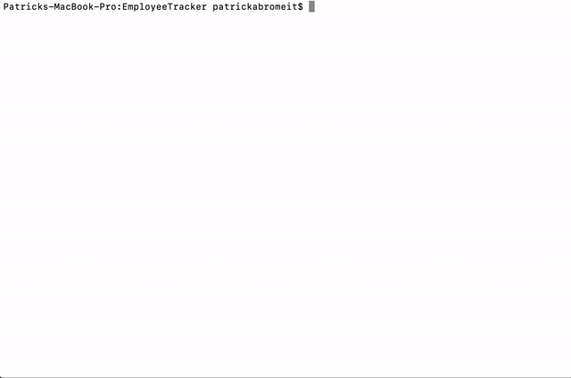

# EmployeeTracker

The EmployeeTracker app is a Content Management System (CMS) to store employee information. The data is stored in a MySQL database and is run through CLI.

To start the app, the user will type "node start" into their terminal. The use will be prompted with the following options: 
  * View departments, roles, employees
  * Add departments, roles, employees
  * Remove departments, roles, employees
  * Update an employee's manager

Follow the prompts to perform any action. Please watch the below GIF for a demonstration.

